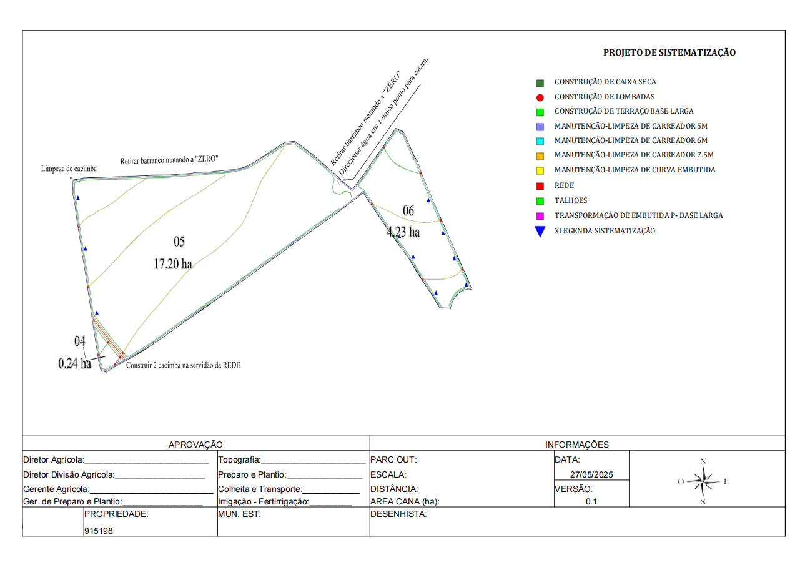
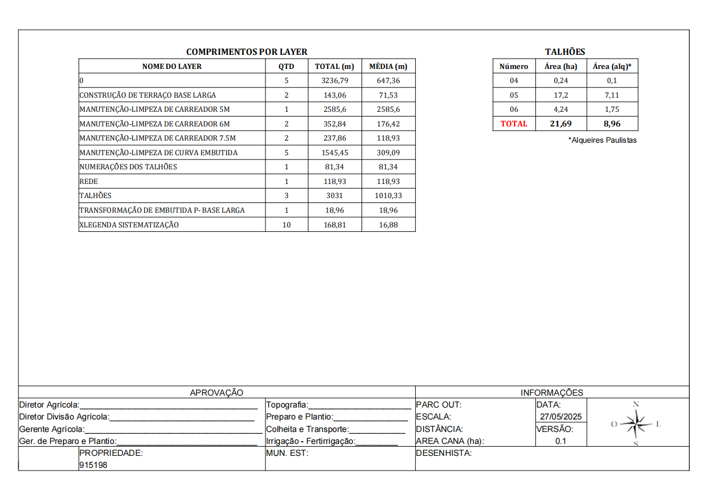

# 📐 DXF - READER

O sistema é uma solução especializada desenvolvida para simplificar e automatizar o processamento de arquivos DXF (formato padrão utilizado por softwares de desenho técnico, como AutoCAD), com o objetivo de gerar relatórios e planilhas detalhadas e precisas para projetos de sistematização agrícola, especialmente para o plantio.

---

## ✅ Funcionalidades

- 📁 Interface intuitiva para seleção de arquivos `.dxf`
- 🗺️ Visualização interativa do mapa DXF com filtros de layers
- 📏 Ferramenta de medição direta no mapa
- 🧾 Geração automática de:
  - Tabela de **comprimentos por layer**
  - Tabela de **talhões**
  - Legenda com cores e nomes dos layers
- 🖼️ Inserção automática da imagem do mapa
- 📄 Geração de planilha Excel + PDF
- 🔒 Interface limpa, sem terminal aberto na versão empacotada

---

<h3 align="center">🎬 Demonstração do Projeto</h3>

  

---

## 🖥️ Interface Inicial

  

  

---

## 🗺️ Visualização Interativa do DXF

  

O sistema renderiza automaticamente o mapa extraído do DXF, preservando as cores, textos e geometrias.  
Na lateral direita, você tem botões para redefinir visualização, medir distâncias e salvar a figura final.

---

## ✅ Preenchimento da Planilha e Filtros por Layer

  

O campo "desenhista" sempre salva o último nome inserido para agilizar o preenchimento.

Antes de gerar a planilha, o sistema permite selecionar **quais layers devem ser incluídos nos cálculos**.

---

## 📄 Mapa e Legenda Gerados na Planilha

  

  

A planilha gerada inclui:

- Mapa do DXF renderizado
- Legenda automática baseada nos layers utilizados
- Dados preenchidos automaticamente:
  - **Data atual**
  - **Versão (incremental)**
  - Nome da propriedade (arquivo DXF)
  - Área Cana, Escala, Distância (preenchidos pelo usuário)

---

## 📊 Tabelas de Comprimentos e Talhões

Com base nas linhas do DXF, o sistema calcula:

- **Comprimento por layer** (quantidade, total e média)
- **Área por talhão**, em hectares e alqueires
- **Soma total da área cultivável**

> 🔄 As tabelas são montadas automaticamente com base nos layers visíveis e textos próximos às geometrias.

---

